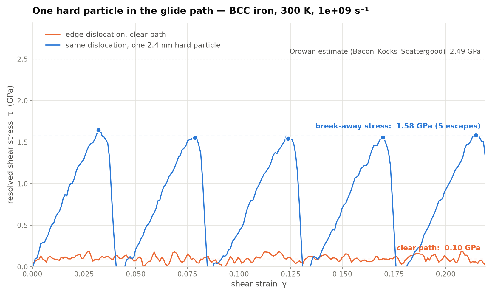

# Putting a precipitate in the dislocation's path

The companion to [`../shear_demo`](../shear_demo). That demo showed *why* a
crystal with a dislocation is weak. This one shows how you make it strong again:
put something in the dislocation's way.

Two runs, side by side:

| | specimen | result |
|---|---|---|
| left | the edge-dislocation cell from `../shear_demo`, reused verbatim | glides freely |
| right | the same cell, one hard 2.4 nm particle on the glide plane | pinned, bows, leaves Orowan loops |



## Why this is a genuine controlled comparison

The right-hand specimen is built from exactly the same `build_edge(26, 8, 7)`
call as the left. The particle is a sphere of atoms tagged as atom type 2, but
**both types map to Fe in the potential**, so there is no chemistry, no misfit,
and no coherency strain. The particle atoms relax together with everything else
during minimisation — the relaxed starting structure is *identical* to the
dislocation-only run, down to the last digit:

```
clean edge   PE = -69832.2167 eV   non-BCC (CNA) 1218 / 17136
edge+particle PE = -69832.2167 eV   non-BCC (CNA) 1218 / 17136
```

From the thermal equilibration onwards, those 612 atoms are simply never
integrated. The single difference between the two simulations is that a sphere
of atoms is not allowed to move.

## What the particle models

A hard, **non-shearable** second-phase particle — an oxide in an ODS steel is the
closest real analogue. Because the dislocation cannot cut it, it must bow
between the particle and its periodic images and pinch off an **Orowan loop**.
Holding the particle rigid isolates that purely geometric mechanism.

A *shearable* coherent precipitate (Cu in Fe is the classic MD case) would
instead be cut by the dislocation, and needs a genuine Fe–Cu alloy potential;
none ships with LAMMPS, so that variant is not done here.

## Geometry

* particle diameter **D = 24 Å** (2.4 nm), 612 atoms, 3.6 % of the cell
* centre on the glide plane at (12.0, 31.25, 24.5) Å — the core starts at
  x = 32.1 and glides in −x, so it meets the particle after ~9 Å and then every
  ~40 Å as it wraps through the periodic cell
* free channel between periodic images of the particle: **L = 25.0 Å**

That spacing is far denser than any real alloy, so the strengthening here is
correspondingly enormous — see the caveats.

## Running it

Run `../shear_demo/run_all.sh` first (it supplies the clear-path half), then:

```bash
./run_all.sh
```

Outputs in `out/`:

| file | what |
|---|---|
| `precipitate_demo.mp4` | the two-panel movie over the shared τ–γ chart |
| `precipitate_stress_strain.png` | the chart alone, for slides |
| `edge_precip.stress.txt` | γ, τ_virial, τ_wall, T |
| `edge_precip.relaxed.dump` | starting structure (type 2 = particle) |
| `edge_precip.shear.dump` | full trajectory (git-ignored) |

### In OVITO

The particle is atom **type 2**, so *Select type → 2* isolates it immediately.
Add DXA with the BCC input lattice to watch the line bow around it and see the
Orowan loop left behind after each break-through.

## Caveats

* L = 2.5 nm is a particle spacing far beyond anything metallurgical, so the
  measured increment is an upper bound by a wide margin. The Orowan stress
  scales as ~1/L: at a realistic 100 nm spacing the same formula gives tens of
  MPa, not GPa.
* Rigid means infinitely strong. A real particle has a finite interface strength
  and can be sheared, bypassed by cross-slip, or climbed over at temperature.
* One dislocation and one particle is not a microstructure — real strengthening
  is a statistical average over a forest of both.
