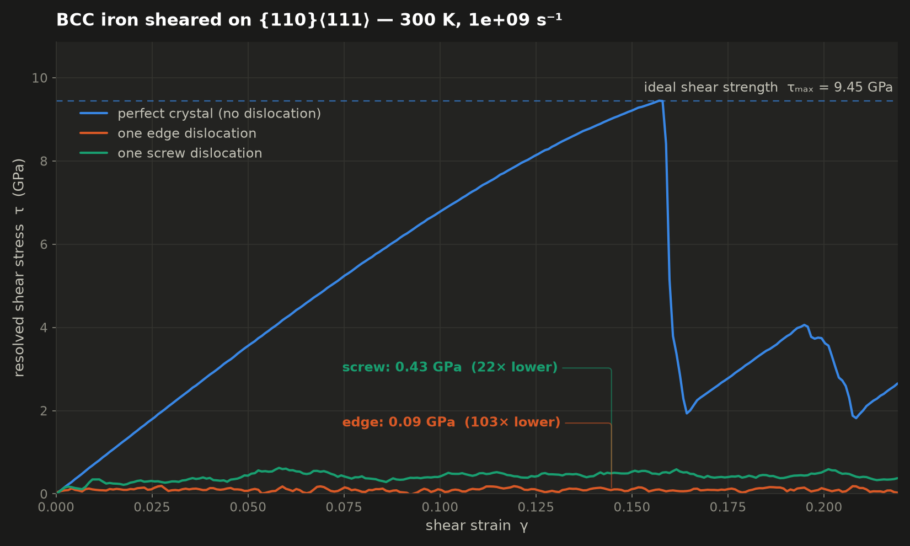

# The shear-strength anomaly, in one movie

A molecular-dynamics demonstration of why a real metal crystal yields at a stress
one to two orders of magnitude below the strength its bonds imply — because it
contains dislocations.

> **These are artificial, qualitative demonstrations.** They are built to make a mechanism
> visible, not to predict a material. The crystals are a few nanometres across; the shear is
> applied at about 10⁹ s⁻¹, some twelve orders of magnitude faster than a laboratory test;
> and one dislocation in a cell this size is a density far beyond any real microstructure.
> What happens on screen is real physics — the stresses below are **not** material
> properties of iron and should not be quoted as such. Treat every number as illustrative of
> a trend, not as a measurement.

Three blocks of BCC iron are sheared side by side under **identical** loading.
They differ only in what they contain:

| specimen | contains | dislocation line |
|---|---|---|
| `perfect` | nothing | — |
| `edge`    | one `a/2[111]` edge dislocation  | along `[11-2]`, ⟂ **b** |
| `screw`   | one `a/2[111]` screw dislocation | along `[111]`,  ∥ **b** |



## Result

| quantity | value |
|---|---|
| elastic shear modulus, G | 68.7 GPa |
| **ideal shear strength, τ_max** | **9.45 GPa** at γ = 0.157 — that is G/7, right on the Frenkel estimate G/2π |
| flow stress, one screw dislocation | 0.43 GPa — **22× lower** |
| flow stress, one edge dislocation | 0.09 GPa — **103× lower** |

The perfect lattice has to shear every bond on the slip plane simultaneously, and
it holds out to 9.45 GPa before nucleating slip catastrophically — the stress
collapses by a factor of five in a few tenths of a percent of strain. The two
crystals that already contain one dislocation never get near that: they start
flowing almost immediately, because the dislocation only has to break bonds along
its core, a row at a time.

That the screw is ~5× harder than the edge is the other half of the story, and it
is specific to BCC: the screw core spreads onto three {110} planes and has to be
constricted before it can move.

## Why the three cells are directly comparable

The usual difficulty is that an edge and a screw dislocation need different cell
orientations, because the line must lie along a periodic cell axis and the two
line directions are perpendicular to each other. Here that is avoided: **both**
`[111]` and `[11-2]` are axes of one and the same orthogonal frame,

```
x = [111]     Burgers vector b = a/2[111], and the shear direction
y = [1-10]    normal of the (1-10) slip plane, the loading axis
z = [11-2]    the remaining in-plane direction
```

so the edge line is put along **z** and the screw line along **x** in *the same
box*. All three specimens therefore share

* the same orientation and the same box, 64.3 × 64.6 × 49.0 Å,
* the same atom count to within 1.9 % (17 472 / 17 136 / 17 472),
* the same slip system `(1-10)[111]`, and
* the same loading — the top grip slides along **+x**, so the driving resolved
  shear stress is `τ = σ_xy` in every case.

Nothing differs between the movies except the character of the dislocation.

## Method

* **Potential** — Mendelev-type EAM for Fe (`Fe_mm.eam.fs`, shipped with LAMMPS);
  it reproduces `a₀ = 2.8553 Å` and `E_coh = −4.122 eV/atom`.
* **Edge dislocation** — misfit construction: the lower half of the crystal holds
  `nx` periods of `[111]` along x, the upper half `nx−1` periods stretched to the
  same length. The halves differ by exactly one Burgers vector, and on relaxation
  that misfit localises into a single edge dislocation on the joining plane.
* **Screw dislocation** — the Volterra field of a *periodic row* of screws,
  `u_x = (b/2π)·arg sin(π(z′+iy′)/L_z)`, so the field is smooth and periodic along
  the glide direction. Two details matter: the bare field leaves a ±b/2 offset
  across the periodic boundary, which is **not** a lattice translation and seeds a
  spurious fault — adding the uniform shear `b·z′/(2L_z)` moves the whole
  discontinuity to one side where it becomes exactly one Burgers vector. And the
  core is placed at the BCC **easy-core** position, the centroid of three ⟨111⟩
  columns, which also keeps the branch cut off every atomic row.
* **Loading** — the crystal is held between two 8 Å rigid grips normal to y. The
  lower grip is fixed, the upper one translated at constant velocity, so
  `γ(t) = v t / h` rises linearly: displacement (strain) controlled.
* **Stress** — virial stress of the mobile region. The total force on the upper
  grip is recorded as an independent cross-check (`tau_wall`, which carries a
  constant offset from holding the grip atoms at unrelaxed positions).
* **Conditions** — 300 K (Langevin), `γ̇ = 1×10⁹ s⁻¹`, 2 fs timestep, to γ = 0.22
  (110 000 steps; ~40 min for all three on 4 cores).

### Validation

`src/check_modulus.py` measures the shear modulus of this slip system
independently, on a fully periodic perfect crystal deformed by an explicit box
tilt: **G = 71.5 GPa**. The elastic branch of the sheared slab reproduces
**72.0 GPa**, so the geometry, the strain definition and the virial stress all
agree with an independent reference.

After relaxation the perfect cell contains **zero** non-BCC interior atoms; the
edge cell contains one core, 8.5 Å wide, running the full 48.9 Å of z; the screw
cell one core, 4.6 Å wide, running the full 63.7 Å of x. (CNA, 3.447 Å cutoff.)

## Running it

Everything runs on CPU with the LAMMPS Python wheel — no GPU, no external data.

```bash
pip install lammps matplotlib imageio imageio-ffmpeg   # needs libmpich12
./run_all.sh          # production, ~40 min on 4 cores
./run_all.sh quick    # coarse preview, ~6 min
```

Outputs land in `out/prod/`:

| file | what |
|---|---|
| `shear_dislocation_demo.mp4` | the movie: three 3D views over the live τ–γ chart |
| `stress_strain.png` | the chart alone, for slides |
| `<case>.stress.txt` | γ, τ_virial, τ_wall, T — interval averages |
| `<case>.relaxed.dump` | the starting structure, with CNA and centrosymmetry |
| `<case>.shear.dump` | the full trajectory (~140 MB each, git-ignored) |

### Viewing in OVITO

The `.dump` files are ordinary LAMMPS text dumps. Open `<case>.shear.dump`, then
add **Common neighbor analysis** and **Dislocation analysis (DXA)** with the BCC
input lattice to extract the line and read off its Burgers vector directly. The
`c_cna` column is already in the file (3 = BCC), so a quick
*Expression selection* of `c_cna != 3` plus *Delete selected* leaves just the
core and the surfaces.

## Caveats worth stating in a lecture

* MD strain rates are ~10⁹ s⁻¹, some twelve orders of magnitude above a lab test,
  so the flow stresses here are upper bounds; the real contrast is larger still.
* One dislocation in a 17 000-atom cell is a density of ~10¹⁶ m⁻², far above an
  annealed metal. A real crystal yields lower again because its dislocations
  multiply and travel much further.
* The screw is the harder of the two in BCC, and strongly thermally activated —
  its motion is by kink-pair nucleation, so its flow stress falls steeply with
  temperature while the edge's barely moves. That asymmetry is the origin of the
  strong temperature dependence of the yield strength of BCC metals, and is
  visible here as the gap between the orange and green curves.


## Rendering notes

The movies are drawn on a white background with the bulk lattice hidden, so the
dislocation line, the grips and the cell frame carry the picture. Each panel
shows the **undeformed supercell** as a dashed outline and the **sheared
supercell** as a solid one — the growing gap between them is the applied shear
strain, made visible.

Pass `--bulk` to either renderer to bring the ghost lattice back.
